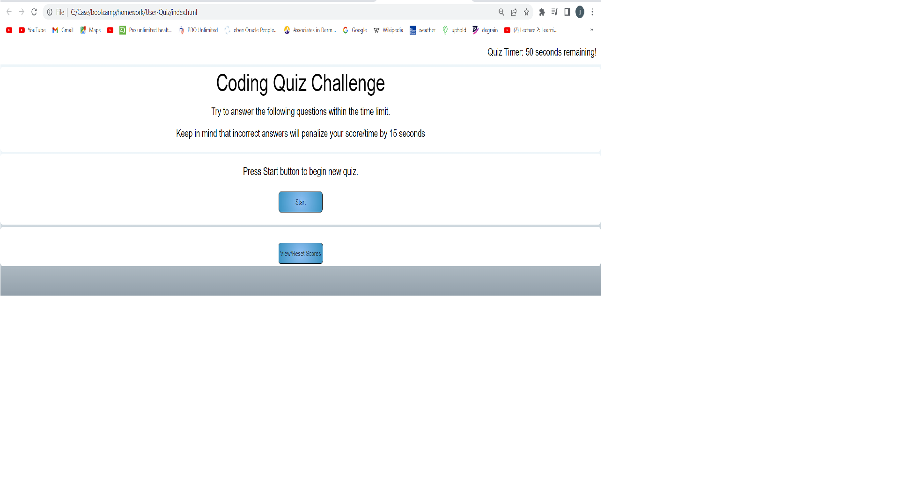

# User-Quiz

## Description

This application invites take a timed coding quiz with multiple-choice questions. This app will run in the browser and will feature dynamically updated HTML and CSS powered by JavaScript code. 

 
 During this project I learned to importance of using window prompts and alerts  as well as defining and using javascript functions to interact with the user, media queries to actively adjust display to different screen sizes, as how make better use of CSS by consolidating redundant classes.

## Usage

To use the User Quiz website, please visit <https://mcgreevyjim66.github.io/User-Quiz/>

## Source

My repo, is located at <https://github.com/mcgreevyjim66/User-Quiz>.
There is source code located in the User-Quiz folder, as well as in the ./assets/images, ./assets/css and ./assets/js folders.

## Mock-up

## Credits

Author: Jim McGreevy
Date:   7/26/2023

